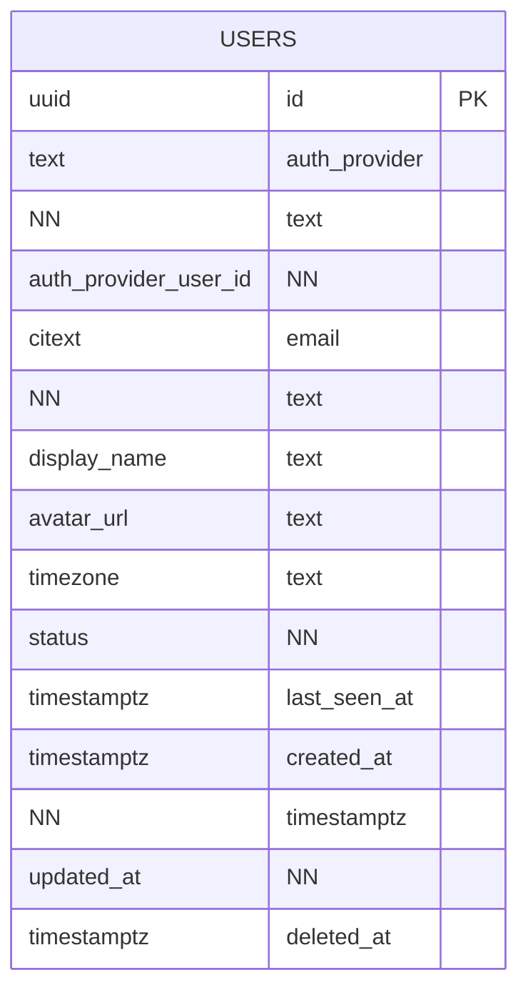
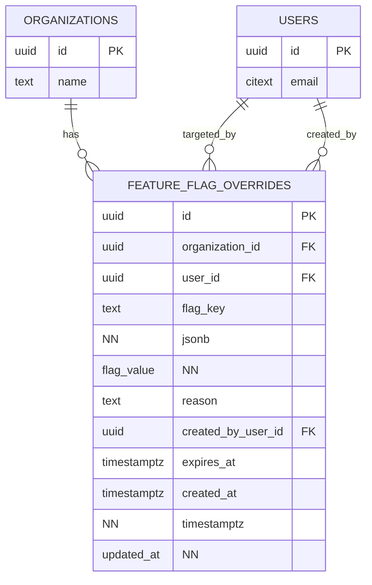
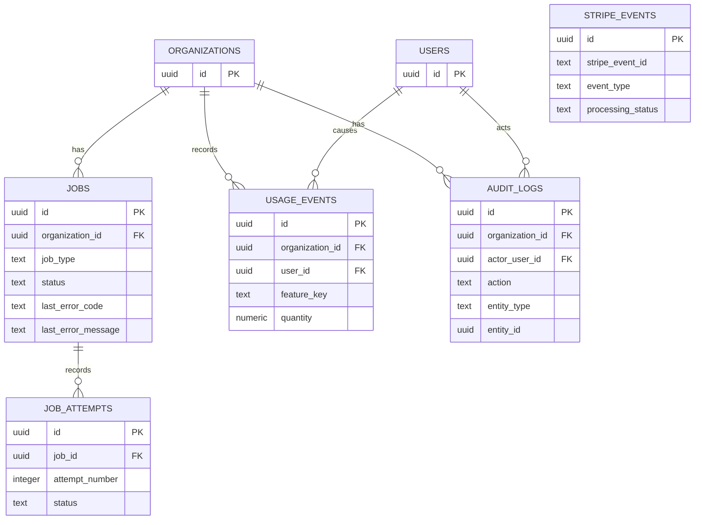
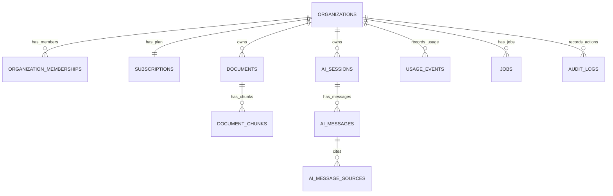

This is an **incremental ERD execution plan** for the 24-sprint roadmap. Each sprint shows what the database should look like **after that sprint**, focusing on new entities, changed entities, and relationships. The sequence follows the earlier PRD and the roadmap’s recommended order: data modeling, auth/permissions, payments, observability, async jobs, AI cost control, caching/rate limiting, Electron hardening, real-time systems, and launch operations.

Use this as your database build guide:

```txt
Sprint 0       No product database yet
Sprints 1–5   SaaS foundation
Sprints 6–10  Documents, jobs, AI, RAG
Sprints 11–14 Admin, email, feedback, hardening
Sprints 15–18 Electron desktop
Sprints 19–21 Real-time and collaboration
Sprints 22–24 Performance, cost, launch, studies
```

---

# ERD notation

```txt
PK  = Primary Key
FK  = Foreign Key
UQ  = Unique Constraint
NN  = Not Null
```

Recommended default columns for most tables:

```txt
id UUID PRIMARY KEY
created_at TIMESTAMPTZ NOT NULL DEFAULT now()
updated_at TIMESTAMPTZ NOT NULL DEFAULT now()
deleted_at TIMESTAMPTZ NULL, where soft delete is needed
```

Recommended tenant rule:

```txt
Every business table should include organization_id unless it is truly global.
```

---

# Sprint 0: Product and engineering setup

## Sprint database goal

No product ERD yet. This sprint prepares the repo, deployment, CI, environment variables, and migration system.

## Tables added

```txt
None
```

## ERD state

```txt
No application tables yet.
```

## Optional technical table

If you want migration tracking outside your ORM/tooling, you may have:

```txt
schema_migrations
```

But most migration tools already handle this.

## Mermaid ERD

```mermaid
erDiagram
    %% Sprint 0: No product entities yet.
```

## Acceptance criteria

```txt
Database project exists.
Migration command works.
Seed command placeholder exists.
CI can validate migrations or at least run typecheck/lint.
```

---

# Sprint 1: Auth, user model, and protected dashboard

## Sprint database goal

Create the app-level user model. External auth provider owns authentication, but your app owns the relational user record.

## Tables added

```txt
users
```

## ERD after Sprint 1



## Table details

### `users`

|Column|Purpose|
|---|---|
|`id`|Internal app user ID|
|`auth_provider`|`clerk`, `supabase`, etc.|
|`auth_provider_user_id`|External provider user ID|
|`email`|User email|
|`display_name`|Profile display name|
|`avatar_url`|Optional avatar|
|`timezone`|Useful for usage/billing display|
|`status`|`active`, `disabled`, `deleted`|
|`last_seen_at`|Last app activity|

## Required constraints

```sql
UNIQUE (auth_provider, auth_provider_user_id)
UNIQUE (email)
```

## Design note

At this point, the app knows **who the user is**, but not yet which organization they belong to.

---

# Sprint 2: Organizations, memberships, and tenant boundaries

## Sprint database goal

Introduce multi-tenancy. Users belong to organizations through memberships. Organizations become the main ownership boundary for future data.

## Tables added

```txt
organizations
organization_memberships
audit_logs
```

## ERD after Sprint 2

```mermaid
erDiagram
    USERS {
        uuid id PK
        text auth_provider
        text auth_provider_user_id
        citext email
        text status
        timestamptz created_at
    }

    ORGANIZATIONS {
        uuid id PK
        text name NN
        citext slug NN
        uuid owner_user_id FK
        text status NN
        jsonb metadata
        timestamptz created_at NN
        timestamptz updated_at NN
        timestamptz deleted_at
    }

    ORGANIZATION_MEMBERSHIPS {
        uuid id PK
        uuid organization_id FK NN
        uuid user_id FK NN
        text role NN
        text status NN
        timestamptz joined_at
        timestamptz created_at NN
        timestamptz updated_at NN
    }

    AUDIT_LOGS {
        uuid id PK
        uuid organization_id FK
        uuid actor_user_id FK
        text action NN
        text entity_type NN
        uuid entity_id
        jsonb before_state
        jsonb after_state
        jsonb metadata
        inet ip_address
        text user_agent
        timestamptz created_at NN
    }

    USERS ||--o{ ORGANIZATION_MEMBERSHIPS : belongs_to
    ORGANIZATIONS ||--o{ ORGANIZATION_MEMBERSHIPS : has_members
    USERS ||--o{ ORGANIZATIONS : owns
    ORGANIZATIONS ||--o{ AUDIT_LOGS : records
    USERS ||--o{ AUDIT_LOGS : acts
```

## New relationships

|Relationship|Meaning|
|---|---|
|`users → organization_memberships`|A user can belong to many orgs|
|`organizations → organization_memberships`|An org has many members|
|`users → organizations`|A user can own organizations|
|`organizations → audit_logs`|Sensitive actions are tracked per org|

## Required constraints

```sql
UNIQUE (organization_memberships.organization_id, organization_memberships.user_id)
UNIQUE (organizations.slug)
CHECK (organization_memberships.role IN ('owner', 'admin', 'member'))
CHECK (organization_memberships.status IN ('active', 'invited', 'suspended', 'removed'))
```

## Design note

From this sprint onward, future product data should usually include:

```txt
organization_id
created_by_user_id
```

---

# Sprint 3: Plans, entitlements, and local free/pro gating

## Sprint database goal

Add plan definitions, plan limits, subscription state, and usage tracking before Stripe is introduced.

## Tables added

```txt
plans
plan_limits
subscriptions
usage_events
usage_counters
```

## ERD after Sprint 3

```mermaid
erDiagram
    USERS {
        uuid id PK
        citext email
    }

    ORGANIZATIONS {
        uuid id PK
        text name
        uuid owner_user_id FK
    }

    PLANS {
        text id PK
        text name NN
        text billing_interval
        integer price_cents NN
        text currency NN
        text stripe_price_id
        boolean is_active NN
        integer sort_order NN
        timestamptz created_at NN
        timestamptz updated_at NN
    }

    PLAN_LIMITS {
        uuid id PK
        text plan_id FK NN
        text feature_key NN
        integer limit_value
        text limit_unit NN
        text reset_interval NN
        boolean hard_limit NN
        timestamptz created_at NN
        timestamptz updated_at NN
    }

    SUBSCRIPTIONS {
        uuid id PK
        uuid organization_id FK NN
        text plan_id FK NN
        text status NN
        integer seats NN
        timestamptz current_period_start
        timestamptz current_period_end
        boolean cancel_at_period_end NN
        timestamptz trial_end
        jsonb metadata
        timestamptz created_at NN
        timestamptz updated_at NN
    }

    USAGE_EVENTS {
        uuid id PK
        uuid organization_id FK NN
        uuid user_id FK
        text feature_key NN
        text event_type NN
        numeric quantity NN
        text unit NN
        text source_type
        uuid source_id
        text idempotency_key
        jsonb metadata
        timestamptz billing_period_start
        timestamptz billing_period_end
        timestamptz created_at NN
    }

    USAGE_COUNTERS {
        uuid id PK
        uuid organization_id FK NN
        text feature_key NN
        timestamptz period_start NN
        timestamptz period_end NN
        numeric used_quantity NN
        numeric limit_quantity
        timestamptz updated_at NN
    }

    PLANS ||--o{ PLAN_LIMITS : defines
    PLANS ||--o{ SUBSCRIPTIONS : used_by
    ORGANIZATIONS ||--|| SUBSCRIPTIONS : has
    ORGANIZATIONS ||--o{ USAGE_EVENTS : records
    USERS ||--o{ USAGE_EVENTS : causes
    ORGANIZATIONS ||--o{ USAGE_COUNTERS : aggregates
```

## New relationships

|Relationship|Meaning|
|---|---|
|`plans → plan_limits`|Each plan defines multiple feature limits|
|`plans → subscriptions`|Each org subscription points to a plan|
|`organizations → subscriptions`|Each org has one current subscription state|
|`organizations → usage_events`|Raw usage is recorded by org|
|`organizations → usage_counters`|Fast quota counters are stored by org/period|

## Required constraints

```sql
UNIQUE (plan_limits.plan_id, plan_limits.feature_key)
UNIQUE (subscriptions.organization_id)
UNIQUE (usage_events.idempotency_key)
UNIQUE (
  usage_counters.organization_id,
  usage_counters.feature_key,
  usage_counters.period_start,
  usage_counters.period_end
)
```

## Seed data

```txt
plans:
- free
- pro_monthly
- pro_yearly
```

Example `plan_limits`:

```txt
free.ai_messages = 10/day
free.document_uploads = 3/day
free.max_file_size_mb = 5/none

pro_monthly.ai_messages = 500/billing_period
pro_monthly.document_uploads = 100/billing_period
pro_monthly.max_file_size_mb = 50/none
```

---

# Sprint 4: Stripe Checkout, subscriptions, and webhook idempotency

## Sprint database goal

Add Stripe customer mapping and webhook idempotency. Extend subscriptions with Stripe fields.

## Tables added

```txt
billing_customers
stripe_events
```

## Tables changed

```txt
subscriptions
plans
```

Add Stripe-specific fields if not already present:

```txt
plans.stripe_price_id
subscriptions.billing_customer_id
subscriptions.stripe_subscription_id
subscriptions.stripe_price_id
```

## ERD after Sprint 4

```mermaid
erDiagram
    ORGANIZATIONS {
        uuid id PK
        text name
    }

    USERS {
        uuid id PK
        citext email
    }

    PLANS {
        text id PK
        text name
        text stripe_price_id
    }

    BILLING_CUSTOMERS {
        uuid id PK
        uuid organization_id FK NN
        text stripe_customer_id NN
        citext billing_email
        uuid created_by_user_id FK
        timestamptz created_at NN
        timestamptz updated_at NN
    }

    SUBSCRIPTIONS {
        uuid id PK
        uuid organization_id FK NN
        uuid billing_customer_id FK
        text plan_id FK NN
        text stripe_subscription_id
        text stripe_price_id
        text status NN
        integer seats NN
        timestamptz current_period_start
        timestamptz current_period_end
        boolean cancel_at_period_end NN
        timestamptz trial_end
        jsonb metadata
        timestamptz created_at NN
        timestamptz updated_at NN
    }

    STRIPE_EVENTS {
        uuid id PK
        text stripe_event_id NN
        text event_type NN
        text processing_status NN
        jsonb payload NN
        text error_message
        timestamptz received_at NN
        timestamptz processed_at
        timestamptz created_at NN
    }

    ORGANIZATIONS ||--|| BILLING_CUSTOMERS : has
    USERS ||--o{ BILLING_CUSTOMERS : creates
    BILLING_CUSTOMERS ||--o{ SUBSCRIPTIONS : owns
    ORGANIZATIONS ||--|| SUBSCRIPTIONS : has
    PLANS ||--o{ SUBSCRIPTIONS : selected_by
```

## Required constraints

```sql
UNIQUE (billing_customers.organization_id)
UNIQUE (billing_customers.stripe_customer_id)
UNIQUE (subscriptions.organization_id)
UNIQUE (subscriptions.stripe_subscription_id)
UNIQUE (stripe_events.stripe_event_id)
```

## Design note

Stripe state must be webhook-driven.

```txt
Checkout redirect does not unlock Pro.
Stripe webhook updates subscription.
stripe_events prevents duplicate side effects.
```

---

# Sprint 5: Observability, analytics, and feature flags

## Sprint database goal

Most observability data lives in Sentry and PostHog, so this sprint may not require new app tables.

## Tables added

```txt
None required
```

## Optional table added

If you want local feature overrides in addition to PostHog:

```txt
feature_flag_overrides
```

## Optional ERD after Sprint 5



## Recommended flags

```txt
document_upload_enabled
ai_chat_enabled
rag_v1_enabled
desktop_upload_enabled
realtime_status_enabled
```

## Design note

You do not need this table if PostHog fully owns feature flags. For a solo MVP, external flags are enough.

---

# Sprint 6: File storage and document upload MVP

## Sprint database goal

Add organization-owned files and document metadata.

## Tables added

```txt
storage_objects
documents
```

## ERD after Sprint 6

```mermaid
erDiagram
    USERS {
        uuid id PK
        citext email
    }

    ORGANIZATIONS {
        uuid id PK
        text name
    }

    STORAGE_OBJECTS {
        uuid id PK
        uuid organization_id FK NN
        text bucket NN
        text object_key NN
        text original_filename NN
        text content_type NN
        bigint byte_size NN
        text checksum_sha256
        uuid uploaded_by_user_id FK
        text status NN
        timestamptz created_at NN
        timestamptz deleted_at
    }

    DOCUMENTS {
        uuid id PK
        uuid organization_id FK NN
        uuid storage_object_id FK
        uuid created_by_user_id FK NN
        text title NN
        text source_type NN
        text file_type NN
        text status NN
        text processing_error_code
        text processing_error_message
        integer page_count
        text language
        text checksum_sha256
        timestamptz ready_at
        timestamptz created_at NN
        timestamptz updated_at NN
        timestamptz deleted_at
    }

    ORGANIZATIONS ||--o{ STORAGE_OBJECTS : owns
    USERS ||--o{ STORAGE_OBJECTS : uploads
    ORGANIZATIONS ||--o{ DOCUMENTS : owns
    USERS ||--o{ DOCUMENTS : creates
    STORAGE_OBJECTS ||--o{ DOCUMENTS : backs
```

## Required constraints

```sql
UNIQUE (storage_objects.bucket, storage_objects.object_key)
INDEX (storage_objects.organization_id, storage_objects.created_at)
INDEX (documents.organization_id, documents.status)
INDEX (documents.organization_id, documents.created_at)
```

## Document statuses introduced

```txt
uploaded
queued
processing
chunking
embedding
indexed
ready
failed
deleted
```

## Design note

`storage_objects` represents the physical file.  
`documents` represents the user-facing knowledge object.

---

# Sprint 7: Background jobs and document processing pipeline

## Sprint database goal

Add async job infrastructure and extracted document chunks.

## Tables added

```txt
jobs
job_attempts
document_chunks
```

## ERD after Sprint 7

```mermaid
erDiagram
    ORGANIZATIONS {
        uuid id PK
        text name
    }

    USERS {
        uuid id PK
        citext email
    }

    DOCUMENTS {
        uuid id PK
        uuid organization_id FK NN
        uuid created_by_user_id FK NN
        text title
        text status
    }

    DOCUMENT_CHUNKS {
        uuid id PK
        uuid organization_id FK NN
        uuid document_id FK NN
        integer chunk_index NN
        text text NN
        integer token_count
        integer page_start
        integer page_end
        text section_title
        jsonb metadata
        timestamptz created_at NN
    }

    JOBS {
        uuid id PK
        uuid organization_id FK
        uuid created_by_user_id FK
        text job_type NN
        text status NN
        jsonb payload NN
        text idempotency_key
        integer attempts_count NN
        integer max_attempts NN
        timestamptz run_after NN
        text locked_by
        timestamptz locked_at
        text last_error_code
        text last_error_message
        timestamptz completed_at
        timestamptz failed_at
        timestamptz dead_lettered_at
        timestamptz created_at NN
        timestamptz updated_at NN
    }

    JOB_ATTEMPTS {
        uuid id PK
        uuid job_id FK NN
        integer attempt_number NN
        text status NN
        text error_code
        text error_message
        jsonb metadata
        timestamptz started_at NN
        timestamptz ended_at
    }

    ORGANIZATIONS ||--o{ DOCUMENTS : owns
    DOCUMENTS ||--o{ DOCUMENT_CHUNKS : splits_into
    ORGANIZATIONS ||--o{ DOCUMENT_CHUNKS : owns
    ORGANIZATIONS ||--o{ JOBS : has
    USERS ||--o{ JOBS : creates
    JOBS ||--o{ JOB_ATTEMPTS : records
```

## Required constraints

```sql
UNIQUE (jobs.idempotency_key)
UNIQUE (job_attempts.job_id, job_attempts.attempt_number)
UNIQUE (document_chunks.document_id, document_chunks.chunk_index)
INDEX (jobs.status, jobs.run_after)
INDEX (jobs.organization_id, jobs.status)
INDEX (document_chunks.organization_id, document_chunks.document_id)
```

## Design note

The processing job should use an idempotency key like:

```txt
process_document:{document_id}
```

That prevents duplicate chunks if the same job is created twice.

---

# Sprint 8: AI chat MVP with streaming, rate limits, and usage tracking

## Sprint database goal

Add AI conversations and persistent message history. Usage tracking from Sprint 3 now records AI token/cost data.

## Tables added

```txt
prompt_versions
ai_sessions
ai_messages
```

## Optional table added

```txt
rate_limit_events
```

Rate limiting itself can live in Redis, but this table is useful for debugging.

## ERD after Sprint 8

```mermaid
erDiagram
    USERS {
        uuid id PK
        citext email
    }

    ORGANIZATIONS {
        uuid id PK
        text name
    }

    PROMPT_VERSIONS {
        uuid id PK
        text name NN
        integer version NN
        text prompt_template NN
        text default_model_provider
        text default_model_name
        boolean is_active NN
        uuid created_by_user_id FK
        timestamptz created_at NN
    }

    AI_SESSIONS {
        uuid id PK
        uuid organization_id FK NN
        uuid created_by_user_id FK NN
        uuid prompt_version_id FK
        text title
        text visibility NN
        text status NN
        timestamptz created_at NN
        timestamptz updated_at NN
        timestamptz deleted_at
    }

    AI_MESSAGES {
        uuid id PK
        uuid organization_id FK NN
        uuid session_id FK NN
        uuid parent_message_id FK
        uuid created_by_user_id FK
        text role NN
        text content NN
        text status NN
        text model_provider
        text model_name
        integer input_tokens
        integer output_tokens
        integer total_tokens
        bigint cost_micro_usd
        text error_code
        text error_message
        timestamptz created_at NN
        timestamptz completed_at
    }

    USAGE_EVENTS {
        uuid id PK
        uuid organization_id FK NN
        uuid user_id FK
        text feature_key NN
        text event_type NN
        numeric quantity NN
        text unit NN
        text provider
        text model_name
        integer input_tokens
        integer output_tokens
        integer total_tokens
        bigint cost_micro_usd
        text source_type
        uuid source_id
        text idempotency_key
        timestamptz created_at NN
    }

    RATE_LIMIT_EVENTS {
        uuid id PK
        uuid organization_id FK
        uuid user_id FK
        text endpoint NN
        text limit_key NN
        text action NN
        integer tokens_consumed
        jsonb metadata
        timestamptz created_at NN
    }

    PROMPT_VERSIONS ||--o{ AI_SESSIONS : used_by
    ORGANIZATIONS ||--o{ AI_SESSIONS : owns
    USERS ||--o{ AI_SESSIONS : creates
    AI_SESSIONS ||--o{ AI_MESSAGES : contains
    USERS ||--o{ AI_MESSAGES : creates
    AI_MESSAGES ||--o{ AI_MESSAGES : replies_to
    ORGANIZATIONS ||--o{ USAGE_EVENTS : records
    USERS ||--o{ USAGE_EVENTS : causes
    ORGANIZATIONS ||--o{ RATE_LIMIT_EVENTS : tracks
    USERS ||--o{ RATE_LIMIT_EVENTS : triggers
```

## Required constraints

```sql
UNIQUE (prompt_versions.name, prompt_versions.version)
INDEX (ai_sessions.organization_id, ai_sessions.created_at)
INDEX (ai_messages.organization_id, ai_messages.session_id, ai_messages.created_at)
INDEX (usage_events.organization_id, usage_events.feature_key, usage_events.created_at)
```

## Design note

Every AI request should create or update:

```txt
ai_sessions
ai_messages
usage_events
usage_counters
```

The expensive AI provider call should happen only after:

```txt
auth check
membership check
entitlement check
quota check
rate limit check
```

---

# Sprint 9: Embeddings and RAG retrieval v1

## Sprint database goal

Upgrade chunks into vector-searchable RAG records and add source citations for AI answers.

## Tables added

```txt
ai_message_sources
```

## Tables changed

```txt
document_chunks
```

Add:

```txt
embedding
embedding_model
```

## ERD after Sprint 9

```mermaid
erDiagram
    ORGANIZATIONS {
        uuid id PK
        text name
    }

    DOCUMENTS {
        uuid id PK
        uuid organization_id FK NN
        text title
        text status
    }

    DOCUMENT_CHUNKS {
        uuid id PK
        uuid organization_id FK NN
        uuid document_id FK NN
        integer chunk_index NN
        text text NN
        integer token_count
        integer page_start
        integer page_end
        text section_title
        vector embedding
        text embedding_model
        jsonb metadata
        timestamptz created_at NN
    }

    AI_SESSIONS {
        uuid id PK
        uuid organization_id FK NN
        uuid created_by_user_id FK NN
    }

    AI_MESSAGES {
        uuid id PK
        uuid organization_id FK NN
        uuid session_id FK NN
        text role NN
        text content NN
        text status NN
    }

    AI_MESSAGE_SOURCES {
        uuid id PK
        uuid organization_id FK NN
        uuid ai_message_id FK NN
        uuid document_id FK NN
        uuid document_chunk_id FK NN
        numeric relevance_score
        text citation_label
        integer quote_start_char
        integer quote_end_char
        timestamptz created_at NN
    }

    DOCUMENTS ||--o{ DOCUMENT_CHUNKS : has
    AI_SESSIONS ||--o{ AI_MESSAGES : contains
    AI_MESSAGES ||--o{ AI_MESSAGE_SOURCES : cites
    DOCUMENTS ||--o{ AI_MESSAGE_SOURCES : cited_document
    DOCUMENT_CHUNKS ||--o{ AI_MESSAGE_SOURCES : cited_chunk
    ORGANIZATIONS ||--o{ DOCUMENT_CHUNKS : owns
    ORGANIZATIONS ||--o{ AI_MESSAGE_SOURCES : owns
```

## Required constraints

```sql
UNIQUE (ai_message_sources.ai_message_id, ai_message_sources.document_chunk_id)
INDEX (ai_message_sources.organization_id, ai_message_sources.ai_message_id)
INDEX (document_chunks.organization_id, document_chunks.document_id)
VECTOR INDEX ON document_chunks.embedding
```

## Critical security rule

Every RAG retrieval query must include:

```sql
WHERE document_chunks.organization_id = :current_organization_id
```

Never retrieve vectors globally and filter later in application code.

---

# Sprint 10: Document collections and scoped Q&A

## Sprint database goal

Allow users to organize documents into collections and scope AI sessions to a collection or a single document.

## Tables added

```txt
document_collections
document_collection_items
```

## Tables changed

```txt
ai_sessions
```

Add:

```txt
collection_id
document_id
```

## ERD after Sprint 10

```mermaid
erDiagram
    USERS {
        uuid id PK
        citext email
    }

    ORGANIZATIONS {
        uuid id PK
        text name
    }

    DOCUMENTS {
        uuid id PK
        uuid organization_id FK NN
        text title
        text status
    }

    DOCUMENT_COLLECTIONS {
        uuid id PK
        uuid organization_id FK NN
        uuid created_by_user_id FK NN
        text name NN
        text description
        timestamptz created_at NN
        timestamptz updated_at NN
        timestamptz deleted_at
    }

    DOCUMENT_COLLECTION_ITEMS {
        uuid organization_id FK NN
        uuid collection_id FK NN
        uuid document_id FK NN
        uuid added_by_user_id FK
        timestamptz added_at NN
    }

    AI_SESSIONS {
        uuid id PK
        uuid organization_id FK NN
        uuid created_by_user_id FK NN
        uuid collection_id FK
        uuid document_id FK
        uuid prompt_version_id FK
        text title
        text visibility NN
        text status NN
    }

    ORGANIZATIONS ||--o{ DOCUMENT_COLLECTIONS : owns
    USERS ||--o{ DOCUMENT_COLLECTIONS : creates
    DOCUMENT_COLLECTIONS ||--o{ DOCUMENT_COLLECTION_ITEMS : contains
    DOCUMENTS ||--o{ DOCUMENT_COLLECTION_ITEMS : included_in
    USERS ||--o{ DOCUMENT_COLLECTION_ITEMS : adds
    DOCUMENT_COLLECTIONS ||--o{ AI_SESSIONS : scopes
    DOCUMENTS ||--o{ AI_SESSIONS : scopes
```

## Required constraints

```sql
UNIQUE (document_collections.organization_id, document_collections.name)
PRIMARY KEY (document_collection_items.collection_id, document_collection_items.document_id)
INDEX (document_collection_items.organization_id, document_collection_items.collection_id)
INDEX (document_collection_items.organization_id, document_collection_items.document_id)
```

## Design note

`ai_sessions` can be scoped in one of three ways:

```txt
All organization documents
One collection
One document
```

A clean rule:

```txt
collection_id and document_id should not both be set.
```

---

# Sprint 11: Admin/debug operations

## Sprint database goal

No major new entities are required. Admin pages read existing operational tables.

## Tables added

```txt
None required
```

## Tables used heavily

```txt
jobs
job_attempts
usage_events
usage_counters
stripe_events
ai_messages
audit_logs
documents
```

## Optional table added

If you want to separately track admin operations beyond `audit_logs`:

```txt
admin_actions
```

Usually, `audit_logs` is enough.

## ERD after Sprint 11



## Design note

Admin retry actions should write to `audit_logs`.

Example audit action:

```txt
admin.job.retry
admin.webhook.inspect
admin.subscription.override
```

---

# Sprint 12: Transactional emails and notifications

## Sprint database goal

Add invitations, notifications, and email event tracking.

## Tables added

```txt
invitations
notifications
email_events
```

## ERD after Sprint 12

```mermaid
erDiagram
    USERS {
        uuid id PK
        citext email
    }

    ORGANIZATIONS {
        uuid id PK
        text name
    }

    ORGANIZATION_MEMBERSHIPS {
        uuid id PK
        uuid organization_id FK
        uuid user_id FK
        text role
        text status
    }

    INVITATIONS {
        uuid id PK
        uuid organization_id FK NN
        citext email NN
        text role NN
        text token_hash NN
        uuid invited_by_user_id FK NN
        uuid accepted_by_user_id FK
        text status NN
        timestamptz expires_at NN
        timestamptz accepted_at
        timestamptz revoked_at
        timestamptz created_at NN
        timestamptz updated_at NN
    }

    NOTIFICATIONS {
        uuid id PK
        uuid organization_id FK
        uuid user_id FK NN
        text type NN
        text channel NN
        text title NN
        text body
        text status NN
        text source_type
        uuid source_id
        timestamptz created_at NN
        timestamptz sent_at
        timestamptz read_at
    }

    EMAIL_EVENTS {
        uuid id PK
        uuid notification_id FK
        uuid organization_id FK
        uuid user_id FK
        text provider_message_id
        text template_key NN
        citext recipient_email NN
        text status NN
        text idempotency_key
        text error_message
        timestamptz created_at NN
        timestamptz sent_at
        timestamptz delivered_at
    }

    ORGANIZATIONS ||--o{ INVITATIONS : sends
    USERS ||--o{ INVITATIONS : invited_by
    USERS ||--o{ INVITATIONS : accepted_by
    ORGANIZATIONS ||--o{ ORGANIZATION_MEMBERSHIPS : has
    USERS ||--o{ ORGANIZATION_MEMBERSHIPS : joins
    ORGANIZATIONS ||--o{ NOTIFICATIONS : has
    USERS ||--o{ NOTIFICATIONS : receives
    NOTIFICATIONS ||--o{ EMAIL_EVENTS : emits
    USERS ||--o{ EMAIL_EVENTS : receives
```

## Required constraints

```sql
UNIQUE (invitations.token_hash)
UNIQUE (email_events.provider_message_id)
UNIQUE (email_events.idempotency_key)
INDEX (invitations.organization_id, invitations.email)
INDEX (invitations.status, invitations.expires_at)
```

## Design note

Do not store raw invitation tokens. Store only:

```txt
token_hash
```

---

# Sprint 13: AI feedback, prompt versioning, and evaluation set

## Sprint database goal

Add feedback on AI messages and optionally create persistent RAG evaluation tables.

## Tables added

```txt
ai_feedback
```

## Optional tables added

```txt
rag_eval_sets
rag_eval_cases
rag_eval_runs
rag_eval_results
```

These optional tables are useful if you want a real evaluation system instead of a script-only setup.

## ERD after Sprint 13

```mermaid
erDiagram
    USERS {
        uuid id PK
        citext email
    }

    ORGANIZATIONS {
        uuid id PK
        text name
    }

    PROMPT_VERSIONS {
        uuid id PK
        text name NN
        integer version NN
        text prompt_template NN
        text default_model_provider
        text default_model_name
        boolean is_active NN
        uuid created_by_user_id FK
        timestamptz created_at NN
    }

    AI_MESSAGES {
        uuid id PK
        uuid organization_id FK NN
        uuid session_id FK NN
        text role NN
        text content NN
        text status NN
    }

    AI_FEEDBACK {
        uuid id PK
        uuid organization_id FK NN
        uuid ai_message_id FK NN
        uuid user_id FK NN
        text rating NN
        text comment
        timestamptz created_at NN
    }

    RAG_EVAL_SETS {
        uuid id PK
        uuid organization_id FK
        text name NN
        text description
        uuid created_by_user_id FK
        timestamptz created_at NN
    }

    RAG_EVAL_CASES {
        uuid id PK
        uuid eval_set_id FK NN
        uuid organization_id FK
        text question NN
        text expected_answer
        jsonb expected_source_refs
        jsonb metadata
        timestamptz created_at NN
    }

    RAG_EVAL_RUNS {
        uuid id PK
        uuid eval_set_id FK NN
        uuid prompt_version_id FK
        text model_provider
        text model_name
        text status NN
        timestamptz started_at NN
        timestamptz completed_at
    }

    RAG_EVAL_RESULTS {
        uuid id PK
        uuid eval_run_id FK NN
        uuid eval_case_id FK NN
        text actual_answer
        jsonb retrieved_sources
        numeric score
        text status NN
        jsonb metadata
        timestamptz created_at NN
    }

    AI_MESSAGES ||--o{ AI_FEEDBACK : receives
    USERS ||--o{ AI_FEEDBACK : gives
    ORGANIZATIONS ||--o{ AI_FEEDBACK : owns

    ORGANIZATIONS ||--o{ RAG_EVAL_SETS : owns
    RAG_EVAL_SETS ||--o{ RAG_EVAL_CASES : contains
    RAG_EVAL_SETS ||--o{ RAG_EVAL_RUNS : runs
    PROMPT_VERSIONS ||--o{ RAG_EVAL_RUNS : evaluates
    RAG_EVAL_RUNS ||--o{ RAG_EVAL_RESULTS : produces
    RAG_EVAL_CASES ||--o{ RAG_EVAL_RESULTS : evaluated_by
```

## Required constraints

```sql
UNIQUE (ai_feedback.ai_message_id, ai_feedback.user_id)
UNIQUE (prompt_versions.name, prompt_versions.version)
```

## Optional evaluation constraints

```sql
UNIQUE (rag_eval_results.eval_run_id, rag_eval_results.eval_case_id)
```

## Design note

For MVP, `ai_feedback` is enough. The `rag_eval_*` tables are recommended if you want systematic AI quality tracking.

---

# Sprint 14: MVP hardening and private beta readiness

## Sprint database goal

No new tables. This sprint is about constraints, indexes, security, and cleanup.

## Tables added

```txt
None
```

## Tables hardened

```txt
users
organizations
organization_memberships
subscriptions
stripe_events
documents
document_chunks
jobs
ai_sessions
ai_messages
usage_events
usage_counters
audit_logs
```

## ERD focus after Sprint 14



## Hardening checklist

Add or verify indexes:

```sql
organization_memberships(user_id, organization_id)
documents(organization_id, status)
documents(organization_id, created_at)
document_chunks(organization_id, document_id)
ai_messages(organization_id, session_id, created_at)
usage_events(organization_id, feature_key, created_at)
jobs(status, run_after)
stripe_events(stripe_event_id)
```

Verify constraints:

```txt
No document without organization_id.
No AI message without organization_id.
No usage event without organization_id.
No cross-org document collection items.
No duplicate Stripe event side effects.
No duplicate job processing side effects.
```

---

# Sprint 15: Electron shell and secure desktop foundation

## Sprint database goal

Add desktop installation and session tracking. Add entitlement check history for security/debugging.

## Tables added

```txt
desktop_installations
desktop_sessions
entitlement_checks
```

## ERD after Sprint 15

```mermaid
erDiagram
    USERS {
        uuid id PK
        citext email
    }

    ORGANIZATIONS {
        uuid id PK
        text name
    }

    DESKTOP_INSTALLATIONS {
        uuid id PK
        uuid user_id FK NN
        text device_name
        text platform NN
        text app_version NN
        text machine_fingerprint_hash NN
        text public_key
        text status NN
        timestamptz last_seen_at
        timestamptz created_at NN
        timestamptz updated_at NN
        timestamptz revoked_at
    }

    DESKTOP_SESSIONS {
        uuid id PK
        uuid installation_id FK NN
        uuid user_id FK NN
        uuid organization_id FK
        text session_status NN
        text entitlement_status
        timestamptz entitlement_checked_at
        timestamptz offline_grace_expires_at
        timestamptz created_at NN
        timestamptz last_seen_at
        timestamptz revoked_at
    }

    ENTITLEMENT_CHECKS {
        uuid id PK
        uuid organization_id FK NN
        uuid user_id FK
        uuid desktop_session_id FK
        text feature_key NN
        text result NN
        text plan_id
        text subscription_status
        jsonb limits_snapshot
        text denial_reason
        timestamptz checked_at NN
    }

    USERS ||--o{ DESKTOP_INSTALLATIONS : owns
    DESKTOP_INSTALLATIONS ||--o{ DESKTOP_SESSIONS : creates
    USERS ||--o{ DESKTOP_SESSIONS : uses
    ORGANIZATIONS ||--o{ DESKTOP_SESSIONS : scopes
    ORGANIZATIONS ||--o{ ENTITLEMENT_CHECKS : has
    USERS ||--o{ ENTITLEMENT_CHECKS : requests
    DESKTOP_SESSIONS ||--o{ ENTITLEMENT_CHECKS : triggers
```

## Required constraints

```sql
UNIQUE (desktop_installations.user_id, desktop_installations.machine_fingerprint_hash)
INDEX (desktop_sessions.user_id, desktop_sessions.organization_id, desktop_sessions.last_seen_at)
INDEX (entitlement_checks.organization_id, entitlement_checks.checked_at)
INDEX (entitlement_checks.feature_key, entitlement_checks.result)
```

## Design note

The desktop client is not trusted. These tables help the server answer:

```txt
Which user?
Which device?
Which organization?
Which feature?
Was entitlement allowed or denied?
```

---

# Sprint 16: Desktop file upload

## Sprint database goal

Track uploads initiated by the desktop app and link them to cloud documents.

## Tables added

```txt
desktop_uploads
```

## ERD after Sprint 16

```mermaid
erDiagram
    ORGANIZATIONS {
        uuid id PK
        text name
    }

    DOCUMENTS {
        uuid id PK
        uuid organization_id FK NN
        text title
        text source_type
        text status
    }

    DESKTOP_INSTALLATIONS {
        uuid id PK
        uuid user_id FK NN
        text platform
        text app_version
    }

    DESKTOP_UPLOADS {
        uuid id PK
        uuid organization_id FK NN
        uuid installation_id FK NN
        uuid document_id FK
        text local_file_name NN
        text local_file_fingerprint_hash
        text status NN
        text error_message
        timestamptz created_at NN
        timestamptz completed_at
    }

    ORGANIZATIONS ||--o{ DESKTOP_UPLOADS : owns
    DESKTOP_INSTALLATIONS ||--o{ DESKTOP_UPLOADS : performs
    DOCUMENTS ||--o{ DESKTOP_UPLOADS : created_from
```

## Required constraints

```sql
INDEX (desktop_uploads.organization_id, desktop_uploads.created_at)
INDEX (desktop_uploads.installation_id, desktop_uploads.created_at)
INDEX (desktop_uploads.document_id)
```

## Design note

Do not store full local file paths by default. Store:

```txt
local_file_name
local_file_fingerprint_hash
```

This reduces privacy risk.

---

# Sprint 17: Desktop entitlement, offline grace, and local cache

## Sprint database goal

No new core tables. Extend desktop session and entitlement tracking.

## Tables changed

```txt
desktop_sessions
entitlement_checks
```

Ensure `desktop_sessions` has:

```txt
entitlement_status
entitlement_checked_at
offline_grace_expires_at
revoked_at
```

Ensure `entitlement_checks` stores:

```txt
limits_snapshot
denial_reason
subscription_status
```

## ERD after Sprint 17

```mermaid
erDiagram
    ORGANIZATIONS {
        uuid id PK
    }

    USERS {
        uuid id PK
    }

    SUBSCRIPTIONS {
        uuid id PK
        uuid organization_id FK NN
        text plan_id FK NN
        text status NN
        timestamptz current_period_end
    }

    DESKTOP_SESSIONS {
        uuid id PK
        uuid installation_id FK NN
        uuid user_id FK NN
        uuid organization_id FK
        text session_status NN
        text entitlement_status
        timestamptz entitlement_checked_at
        timestamptz offline_grace_expires_at
        timestamptz created_at NN
        timestamptz last_seen_at
        timestamptz revoked_at
    }

    ENTITLEMENT_CHECKS {
        uuid id PK
        uuid organization_id FK NN
        uuid user_id FK
        uuid desktop_session_id FK
        text feature_key NN
        text result NN
        text plan_id
        text subscription_status
        jsonb limits_snapshot
        text denial_reason
        timestamptz checked_at NN
    }

    ORGANIZATIONS ||--|| SUBSCRIPTIONS : has
    ORGANIZATIONS ||--o{ DESKTOP_SESSIONS : scopes
    USERS ||--o{ DESKTOP_SESSIONS : uses
    DESKTOP_SESSIONS ||--o{ ENTITLEMENT_CHECKS : triggers
    ORGANIZATIONS ||--o{ ENTITLEMENT_CHECKS : records
```

## Design note

Desktop offline grace is represented in the database as:

```txt
desktop_sessions.offline_grace_expires_at
```

The local desktop cache can mirror this, but the server remains the source of truth.

---

# Sprint 18: Desktop crash reporting and update pipeline

## Sprint database goal

Most desktop crash data lives in Sentry. You may optionally track desktop release/update events locally.

## Optional tables added

```txt
desktop_releases
desktop_update_events
```

## ERD after Sprint 18

```mermaid
erDiagram
    DESKTOP_INSTALLATIONS {
        uuid id PK
        uuid user_id FK NN
        text platform
        text app_version
        text status
        timestamptz last_seen_at
    }

    DESKTOP_RELEASES {
        uuid id PK
        text version NN
        text platform NN
        text channel NN
        text release_notes
        text artifact_url
        text status NN
        timestamptz published_at
        timestamptz created_at NN
    }

    DESKTOP_UPDATE_EVENTS {
        uuid id PK
        uuid installation_id FK NN
        uuid release_id FK
        text from_version
        text to_version
        text channel
        text status NN
        text error_message
        timestamptz created_at NN
        timestamptz completed_at
    }

    DESKTOP_INSTALLATIONS ||--o{ DESKTOP_UPDATE_EVENTS : reports
    DESKTOP_RELEASES ||--o{ DESKTOP_UPDATE_EVENTS : targeted_by
```

## Required constraints if implemented

```sql
UNIQUE (desktop_releases.version, desktop_releases.platform, desktop_releases.channel)
INDEX (desktop_update_events.installation_id, desktop_update_events.created_at)
INDEX (desktop_update_events.status, desktop_update_events.created_at)
```

## Design note

This is optional. For early versions:

```txt
Sentry Electron + release version tags may be enough.
```

Add these tables only if you need your own update visibility.

---

# Sprint 19: Real-time document status with SSE

## Sprint database goal

No new table is required if status updates are derived from durable `documents.status` and `jobs.status`.

## Tables changed

Optional additions to `documents`:

```txt
processing_started_at
processing_completed_at
processing_progress_percent
```

Optional additions to `jobs`:

```txt
progress_percent
progress_message
```

## ERD after Sprint 19

```mermaid
erDiagram
    DOCUMENTS {
        uuid id PK
        uuid organization_id FK NN
        text title
        text status NN
        text processing_error_code
        text processing_error_message
        integer processing_progress_percent
        timestamptz ready_at
        timestamptz processing_started_at
        timestamptz processing_completed_at
    }

    JOBS {
        uuid id PK
        uuid organization_id FK
        text job_type NN
        text status NN
        integer progress_percent
        text progress_message
        jsonb payload NN
        timestamptz completed_at
        timestamptz failed_at
    }

    ORGANIZATIONS {
        uuid id PK
    }

    ORGANIZATIONS ||--o{ DOCUMENTS : owns
    ORGANIZATIONS ||--o{ JOBS : has
```

## Design note

For real-time status, the durable source of truth remains:

```txt
documents.status
jobs.status
```

SSE/WebSocket streams should only notify clients that state changed. The client should refetch durable state after reconnect.

---

# Sprint 20: Presence and shared AI session viewing

## Sprint database goal

Add durable room metadata and participant history. Ephemeral presence can live in Redis or a real-time provider.

## Tables added

```txt
realtime_rooms
room_participants
```

## ERD after Sprint 20

```mermaid
erDiagram
    USERS {
        uuid id PK
        citext email
    }

    ORGANIZATIONS {
        uuid id PK
        text name
    }

    AI_SESSIONS {
        uuid id PK
        uuid organization_id FK NN
        uuid created_by_user_id FK NN
        text visibility NN
        text status NN
    }

    REALTIME_ROOMS {
        uuid id PK
        uuid organization_id FK NN
        text room_type NN
        uuid entity_id NN
        text status NN
        timestamptz created_at NN
        timestamptz closed_at
    }

    ROOM_PARTICIPANTS {
        uuid id PK
        uuid room_id FK NN
        uuid user_id FK NN
        text role NN
        timestamptz joined_at NN
        timestamptz last_seen_at
        timestamptz left_at
    }

    ORGANIZATIONS ||--o{ REALTIME_ROOMS : owns
    REALTIME_ROOMS ||--o{ ROOM_PARTICIPANTS : has
    USERS ||--o{ ROOM_PARTICIPANTS : joins
    AI_SESSIONS ||--o{ REALTIME_ROOMS : can_back
```

## Required constraints

```sql
UNIQUE (realtime_rooms.organization_id, realtime_rooms.room_type, realtime_rooms.entity_id)
INDEX (room_participants.room_id, room_participants.last_seen_at)
INDEX (room_participants.user_id, room_participants.joined_at)
```

## Design note

`realtime_rooms.entity_id` is polymorphic. For Sprint 20:

```txt
room_type = 'ai_session'
entity_id = ai_sessions.id
```

Later it can support:

```txt
document
collection
job
```

---

# Sprint 21: Comments on documents or AI sessions

## Sprint database goal

Add durable collaboration through comments.

## Tables added

```txt
comments
```

## ERD after Sprint 21

```mermaid
erDiagram
    USERS {
        uuid id PK
        citext email
    }

    ORGANIZATIONS {
        uuid id PK
        text name
    }

    DOCUMENTS {
        uuid id PK
        uuid organization_id FK NN
        text title
    }

    AI_SESSIONS {
        uuid id PK
        uuid organization_id FK NN
        text title
    }

    COMMENTS {
        uuid id PK
        uuid organization_id FK NN
        uuid document_id FK
        uuid ai_session_id FK
        uuid parent_comment_id FK
        uuid author_user_id FK NN
        text body NN
        text status NN
        timestamptz created_at NN
        timestamptz updated_at NN
        timestamptz deleted_at
    }

    ORGANIZATIONS ||--o{ COMMENTS : owns
    DOCUMENTS ||--o{ COMMENTS : has
    AI_SESSIONS ||--o{ COMMENTS : has
    COMMENTS ||--o{ COMMENTS : replies_to
    USERS ||--o{ COMMENTS : writes
```

## Required constraints

```sql
CHECK (
  document_id IS NOT NULL
  OR ai_session_id IS NOT NULL
)

INDEX (comments.organization_id, comments.document_id, comments.created_at)
INDEX (comments.organization_id, comments.ai_session_id, comments.created_at)
INDEX (comments.parent_comment_id)
```

## Design note

A comment can belong to:

```txt
a document
or
an AI session
```

For stricter modeling, you could split this into:

```txt
document_comments
ai_session_comments
```

But the polymorphic table is fine for the MVP.

---

# Sprint 22: Database performance, indexes, and load testing

## Sprint database goal

No new product entities. This sprint adds indexes, pagination discipline, and possibly query statistics.

## Tables added

```txt
None required
```

## Optional table added

```txt
performance_test_runs
```

If you want to store load-test outputs in the app database.

## Optional ERD after Sprint 22

```mermaid
erDiagram
    PERFORMANCE_TEST_RUNS {
        uuid id PK
        text name NN
        text target_environment NN
        text endpoint_or_workflow NN
        integer virtual_users
        integer duration_seconds
        numeric p50_ms
        numeric p95_ms
        numeric p99_ms
        numeric error_rate
        jsonb raw_summary
        timestamptz created_at NN
    }
```

## Required index review

By the end of Sprint 22, these indexes should exist or be intentionally rejected:

```sql
organization_memberships(user_id, organization_id)
documents(organization_id, status)
documents(organization_id, created_at)
document_chunks(organization_id, document_id)
ai_sessions(organization_id, created_at)
ai_messages(organization_id, session_id, created_at)
usage_events(organization_id, feature_key, created_at)
jobs(status, run_after)
jobs(organization_id, status)
stripe_events(stripe_event_id)
subscriptions(organization_id)
subscriptions(stripe_subscription_id)
```

## Design note

This sprint is more about **query shape** than table count.

Focus on:

```txt
pagination
N+1 prevention
EXPLAIN ANALYZE
index justification
RAG vector query speed
usage aggregation speed
```

---

# Sprint 23: Caching, cost dashboard, and incident runbooks

## Sprint database goal

Strengthen cost visibility. Caching may use Redis, but cost dashboard reads from usage tables.

## Tables added

```txt
None required
```

## Optional tables added

```txt
cost_snapshots
incident_events
```

These are useful if you want historical reporting and incident timelines.

## ERD after Sprint 23

```mermaid
erDiagram
    ORGANIZATIONS {
        uuid id PK
        text name
    }

    USAGE_EVENTS {
        uuid id PK
        uuid organization_id FK NN
        uuid user_id FK
        text feature_key NN
        text event_type NN
        numeric quantity NN
        text unit NN
        text provider
        text model_name
        integer input_tokens
        integer output_tokens
        integer total_tokens
        bigint cost_micro_usd
        text source_type
        uuid source_id
        timestamptz created_at NN
    }

    COST_SNAPSHOTS {
        uuid id PK
        uuid organization_id FK NN
        date snapshot_date NN
        bigint ai_cost_micro_usd NN
        bigint embedding_cost_micro_usd NN
        bigint storage_cost_micro_usd NN
        bigint total_cost_micro_usd NN
        jsonb breakdown
        timestamptz created_at NN
    }

    INCIDENT_EVENTS {
        uuid id PK
        text incident_key NN
        text severity NN
        text status NN
        text title NN
        text description
        uuid organization_id FK
        text source_type
        uuid source_id
        timestamptz detected_at NN
        timestamptz resolved_at
        timestamptz created_at NN
    }

    ORGANIZATIONS ||--o{ USAGE_EVENTS : records
    ORGANIZATIONS ||--o{ COST_SNAPSHOTS : summarizes
    ORGANIZATIONS ||--o{ INCIDENT_EVENTS : affected_by
```

## Required constraints if optional tables are implemented

```sql
UNIQUE (cost_snapshots.organization_id, cost_snapshots.snapshot_date)
INDEX (incident_events.incident_key)
INDEX (incident_events.severity, incident_events.status)
```

## Design note

You do not need `cost_snapshots` on day one. You can compute cost from `usage_events`.

Add `cost_snapshots` when:

```txt
usage_events becomes large
dashboard queries become slow
you need stable daily cost reporting
```

---

# Sprint 24: Launch readiness, open-source study, and public/private launch

## Sprint database goal

No required new product tables. Add support/feedback and architecture-study records only if you want them in-app.

## Optional tables added

```txt
support_requests
beta_feedback
architecture_studies
```

## ERD after Sprint 24

```mermaid
erDiagram
    USERS {
        uuid id PK
        citext email
    }

    ORGANIZATIONS {
        uuid id PK
        text name
    }

    SUPPORT_REQUESTS {
        uuid id PK
        uuid organization_id FK
        uuid user_id FK
        text category NN
        text subject NN
        text body NN
        text status NN
        text priority
        timestamptz created_at NN
        timestamptz resolved_at
    }

    BETA_FEEDBACK {
        uuid id PK
        uuid organization_id FK
        uuid user_id FK
        text page_url
        text feedback_type NN
        text message NN
        integer rating
        jsonb metadata
        timestamptz created_at NN
    }

    ARCHITECTURE_STUDIES {
        uuid id PK
        uuid created_by_user_id FK
        text project_name NN
        text subsystem NN
        text repo_url
        text summary
        jsonb notes
        timestamptz created_at NN
        timestamptz updated_at NN
    }

    ORGANIZATIONS ||--o{ SUPPORT_REQUESTS : has
    USERS ||--o{ SUPPORT_REQUESTS : submits
    ORGANIZATIONS ||--o{ BETA_FEEDBACK : has
    USERS ||--o{ BETA_FEEDBACK : submits
    USERS ||--o{ ARCHITECTURE_STUDIES : writes
```

## Design note

For a real product, support can also live outside your database:

```txt
Plain email inbox
Crisp
Intercom
HelpScout
Linear
GitHub Issues
```

Add these tables only if support and beta feedback are part of the app itself.

---

# Full cumulative ERD after Sprint 24

By the end of all proposed sprints, the full database can look like this:

```mermaid
erDiagram
    USERS ||--o{ ORGANIZATION_MEMBERSHIPS : has
    ORGANIZATIONS ||--o{ ORGANIZATION_MEMBERSHIPS : has
    USERS ||--o{ ORGANIZATIONS : owns
    ORGANIZATIONS ||--o{ INVITATIONS : sends
    USERS ||--o{ INVITATIONS : invited_by

    PLANS ||--o{ PLAN_LIMITS : defines
    PLANS ||--o{ SUBSCRIPTIONS : used_by
    ORGANIZATIONS ||--|| BILLING_CUSTOMERS : has
    BILLING_CUSTOMERS ||--o{ SUBSCRIPTIONS : owns
    ORGANIZATIONS ||--|| SUBSCRIPTIONS : has

    ORGANIZATIONS ||--o{ STORAGE_OBJECTS : owns
    STORAGE_OBJECTS ||--o{ DOCUMENTS : backs
    ORGANIZATIONS ||--o{ DOCUMENTS : owns
    DOCUMENTS ||--o{ DOCUMENT_CHUNKS : splits_into
    DOCUMENT_COLLECTIONS ||--o{ DOCUMENT_COLLECTION_ITEMS : contains
    DOCUMENTS ||--o{ DOCUMENT_COLLECTION_ITEMS : included_in

    ORGANIZATIONS ||--o{ JOBS : has
    JOBS ||--o{ JOB_ATTEMPTS : records

    PROMPT_VERSIONS ||--o{ AI_SESSIONS : used_by
    ORGANIZATIONS ||--o{ AI_SESSIONS : owns
    DOCUMENT_COLLECTIONS ||--o{ AI_SESSIONS : scopes
    DOCUMENTS ||--o{ AI_SESSIONS : scopes
    AI_SESSIONS ||--o{ AI_MESSAGES : contains
    AI_MESSAGES ||--o{ AI_MESSAGE_SOURCES : cites
    DOCUMENTS ||--o{ AI_MESSAGE_SOURCES : cited_document
    DOCUMENT_CHUNKS ||--o{ AI_MESSAGE_SOURCES : cited_chunk
    AI_MESSAGES ||--o{ AI_FEEDBACK : receives

    ORGANIZATIONS ||--o{ USAGE_EVENTS : records
    ORGANIZATIONS ||--o{ USAGE_COUNTERS : aggregates
    ORGANIZATIONS ||--o{ RATE_LIMIT_EVENTS : tracks
    ORGANIZATIONS ||--o{ AUDIT_LOGS : has

    USERS ||--o{ DESKTOP_INSTALLATIONS : owns
    DESKTOP_INSTALLATIONS ||--o{ DESKTOP_SESSIONS : creates
    DESKTOP_INSTALLATIONS ||--o{ DESKTOP_UPLOADS : performs
    ORGANIZATIONS ||--o{ DESKTOP_UPLOADS : owns
    DOCUMENTS ||--o{ DESKTOP_UPLOADS : creates
    DESKTOP_SESSIONS ||--o{ ENTITLEMENT_CHECKS : triggers

    ORGANIZATIONS ||--o{ REALTIME_ROOMS : owns
    REALTIME_ROOMS ||--o{ ROOM_PARTICIPANTS : has
    ORGANIZATIONS ||--o{ COMMENTS : owns
    DOCUMENTS ||--o{ COMMENTS : has
    AI_SESSIONS ||--o{ COMMENTS : has

    ORGANIZATIONS ||--o{ NOTIFICATIONS : has
    NOTIFICATIONS ||--o{ EMAIL_EVENTS : emits
```

---

# Sprint-by-sprint table matrix

|Sprint|Tables added|Tables changed|
|--:|---|---|
|0|None|None|
|1|`users`|None|
|2|`organizations`, `organization_memberships`, `audit_logs`|`users` referenced by org/membership|
|3|`plans`, `plan_limits`, `subscriptions`, `usage_events`, `usage_counters`|`organizations` gains billing relationship|
|4|`billing_customers`, `stripe_events`|`subscriptions`, `plans` get Stripe fields|
|5|Optional `feature_flag_overrides`|None required|
|6|`storage_objects`, `documents`|`usage_events` records uploads|
|7|`jobs`, `job_attempts`, `document_chunks`|`documents.status` transitions become meaningful|
|8|`prompt_versions`, `ai_sessions`, `ai_messages`, optional `rate_limit_events`|`usage_events` gets AI token/cost fields|
|9|`ai_message_sources`|`document_chunks` gets `embedding`, `embedding_model`|
|10|`document_collections`, `document_collection_items`|`ai_sessions` gets `collection_id`, `document_id`|
|11|None required|Admin reads operational tables|
|12|`invitations`, `notifications`, `email_events`|`organization_memberships` supports invite flow|
|13|`ai_feedback`, optional `rag_eval_*` tables|`prompt_versions` becomes more important|
|14|None|Constraints, indexes, org-isolation hardening|
|15|`desktop_installations`, `desktop_sessions`, `entitlement_checks`|Entitlement model supports desktop|
|16|`desktop_uploads`|`documents.source_type` includes `desktop_upload`|
|17|None|`desktop_sessions`, `entitlement_checks` extended|
|18|Optional `desktop_releases`, `desktop_update_events`|`desktop_installations.app_version` becomes operationally important|
|19|None required|Optional progress fields on `documents`, `jobs`|
|20|`realtime_rooms`, `room_participants`|`ai_sessions.visibility` supports shared sessions|
|21|`comments`|Documents and AI sessions become commentable|
|22|Optional `performance_test_runs`|Indexes and query shapes improved|
|23|Optional `cost_snapshots`, `incident_events`|Usage/cost dashboard strengthened|
|24|Optional `support_requests`, `beta_feedback`, `architecture_studies`|Launch/support workflows added|

---

# Recommended MVP cut

For the first production MVP, stop after Sprint 14 and keep the schema focused.

## MVP required tables

```txt
users
organizations
organization_memberships
audit_logs

plans
plan_limits
billing_customers
subscriptions
stripe_events

usage_events
usage_counters

storage_objects
documents
document_chunks

jobs
job_attempts

prompt_versions
ai_sessions
ai_messages
ai_message_sources

document_collections
document_collection_items

invitations
notifications
email_events

ai_feedback
```

## Defer until post-MVP

```txt
desktop_installations
desktop_sessions
desktop_uploads
entitlement_checks

realtime_rooms
room_participants
comments

cost_snapshots
incident_events
support_requests
beta_feedback
architecture_studies
```

---

# Most important schema rules

## 1. Organization scope is non-negotiable

These tables must always include and filter by `organization_id`:

```txt
documents
document_chunks
document_collections
ai_sessions
ai_messages
ai_message_sources
usage_events
usage_counters
jobs
audit_logs
desktop_sessions
desktop_uploads
entitlement_checks
realtime_rooms
comments
```

## 2. Webhooks must be idempotent

```txt
stripe_events.stripe_event_id UNIQUE
```

## 3. Jobs must be idempotent

```txt
jobs.idempotency_key UNIQUE
```

Example:

```txt
process_document:{document_id}
```

## 4. Usage must be idempotent

```txt
usage_events.idempotency_key UNIQUE
```

Example:

```txt
ai_message:{message_id}:tokens
document:{document_id}:upload
embedding:{chunk_id}:{embedding_model}
```

## 5. RAG must never cross organization boundaries

Every vector query should include:

```sql
WHERE document_chunks.organization_id = :current_organization_id
```

## 6. Desktop clients are not trusted

Desktop tables are for tracking, not for granting authority. Paid features must use server-side entitlement checks.

---

# Suggested implementation order inside each sprint

Use this order for every schema-changing sprint:

```txt
1. Write migration
2. Add indexes and constraints
3. Add seed data if needed
4. Add TypeScript types / ORM schema
5. Add server service layer
6. Add authorization checks
7. Add unit tests
8. Add integration tests
9. Add UI
10. Add analytics and audit events
11. Update ADR
```

That keeps the ERD from becoming just a diagram. Each sprint turns the schema into working product architecture.